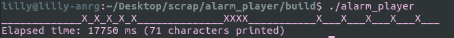

# Alarm Player
Play different alarm "audio" sequences, where only the highest priority alarm plays.

LOW: one beep every 30s, with a beep duration of 1s. Repeat continuously.  
MEDIUM: one beep every second, with a beep duration of 250ms. Repeat continuously.  
HIGH: five beeps every 500ms with duration of 250ms each, then wait for 2s with no beep.
Repeat continuously.  

`src/Alarm.h` is the header file.  
`src/Alarm.cpp` implements the Alarm.  
`src/main.cpp` is the client and shows example usage of the Alarm API.

## How to build
This code is cmake-based. After cloning this repository,  
`mkdir build`  
`cd build`  
`cmake ..`  
`make alarm_player`  
will produce an executable `./alarm_player`.

## How to test
Several simple unit tests are provided in `src/test.cpp`. Run `make test` to build the tests and `./test` to run.

## How to use
After building, run `./alarm_player` to start the alarm. Pressing `h`, `m`, and `l` toggle the high, medium, and low priority alarms.
`Ctrl-c` kills the application, printing a summary of the elapsed time.

## How it works
For the output, the alarm loops and prints every 250ms. Depending on the priority (including off, or no alarm) and how many time steps have passed since an alarm was started, the alarm will print either `_` or `X`.

For the input, the alarm waits for keyboard input, and toggles the appropriate priority. Upon start, the alarm changes the terminal input settings so that pressed keys are not echoed and pressing `ENTER` is not required. Upon stop, the terminal settings are restored.

The input and output threads both run continuously until the application is terminated.
